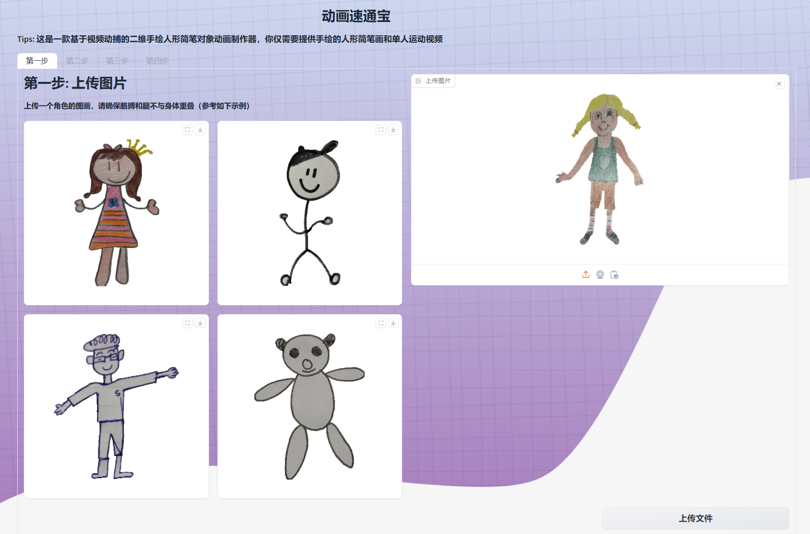
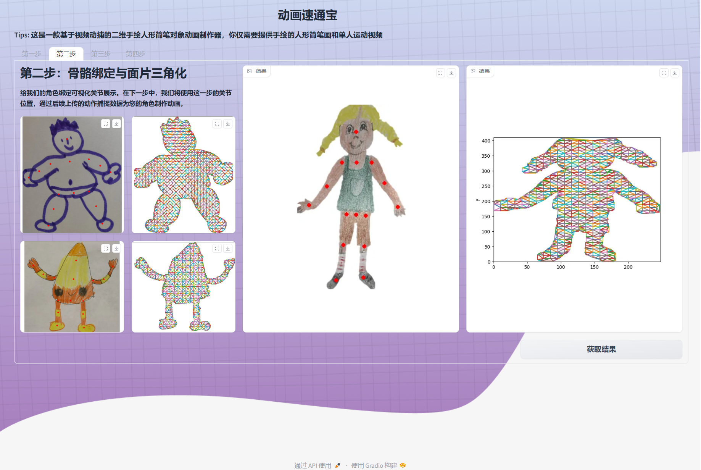
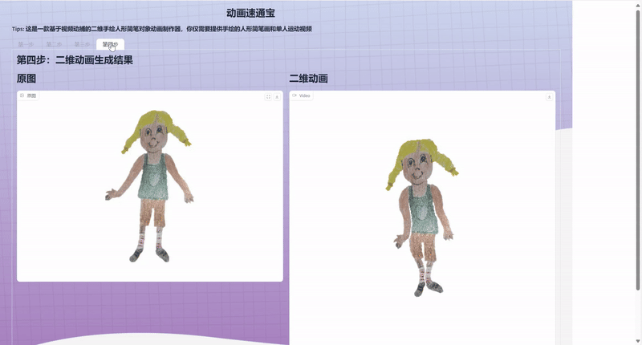

# Simplified Animated Drawings(Fronted Branch)

This is the simplified version
of [facebookresearch/AnimatedDrawings: Code to accompany "A Method for Animating Children's Drawings of the Human Figure" (github.com)](https://github.com/facebookresearch/AnimatedDrawings)
. here we can **custom your monocular video and drawing as input**, framework will automatically generate corresponding.

Here are some generated 2D animation:

|  demo1             |         demo2        |      demo3     |  
| -------------------| -------------------- |----------------|
|      |                   |   |  

## Environment Preparation

The Python version is 3.10.13. And you can install other packages use below command:

```shell
pip install -r requirements.txt
```

## Operation Steps

1. Upload image.
   
2. Check intermediate results.(Optional)
   
3. Upload the specified action files. These can be *.mp4 video files shot with the person facing the camera, or *.bvh
   files that conform to the example specification (see the page for details).
   
4. See animation result.
   