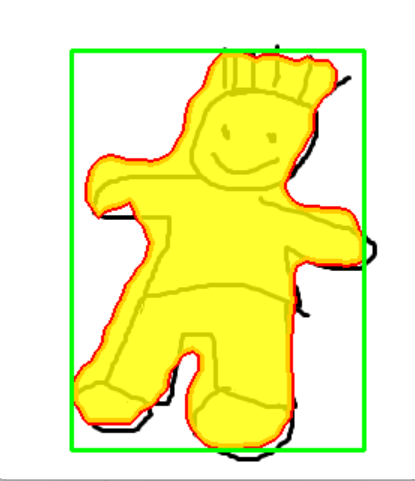
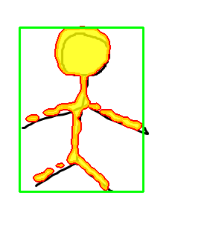
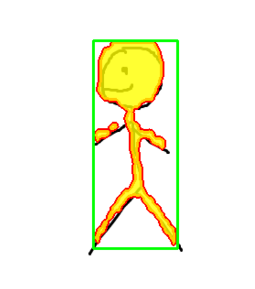
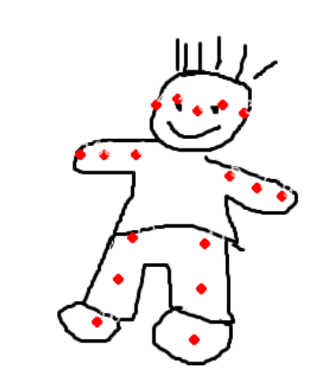
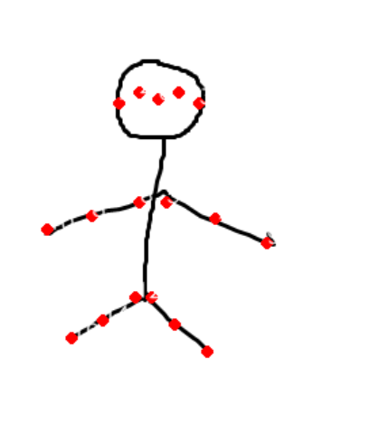
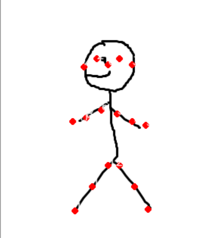
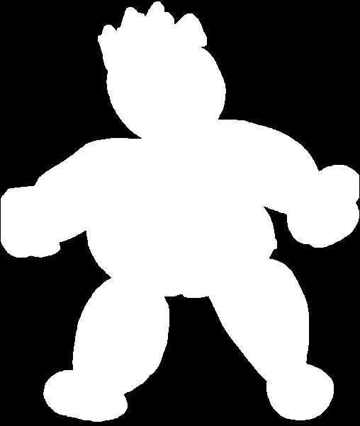
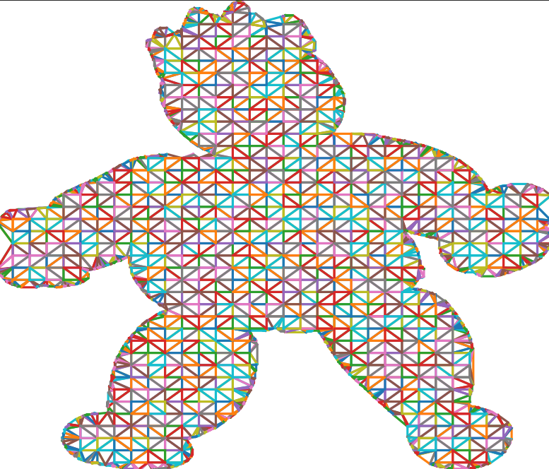
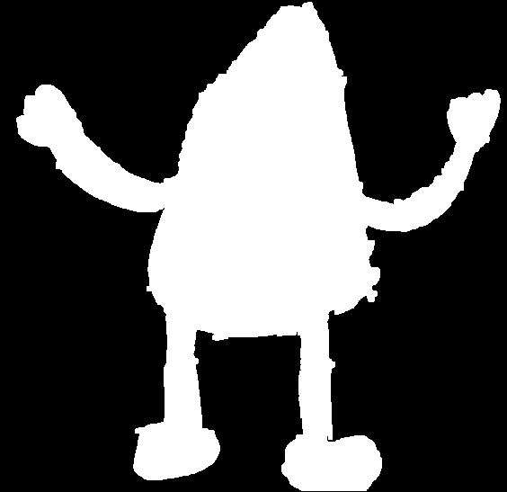
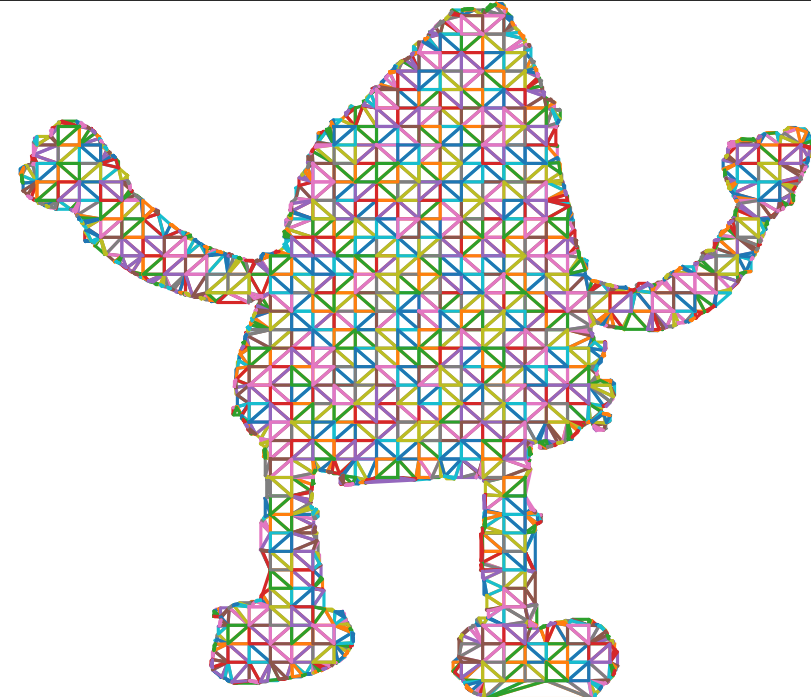

# Understanding of AnimatedDrawing

Official details of this comes from [animated drawings repository](https://github.com/facebookresearch/AnimatedDrawings)
, see document of details in [initial README.md](OFFICIAL_README.md).

# Deployment for Keyopints Estimation and Detection

To simplify the dependency of OpenMMLAb, here, we deploy these *.pth checkpoint into *.onnx files.

## Environment and Source Checkpoints Prepare

Here are some tips:

- Some packages about OpenMMLab includes mmcv, mmpose and mmdet, you should install mmcv-full==1.7.0 at first, and
  **then use source code
  for [mmpose==0.29.0 and mmdet==2.25.2 have been stored under `deployment/env_prepare`](deployment/env_prepare)** ,
  please install by using `pip install -v -e .` respectively.


- The source checkpoints trained from collected data are offered
  by [official Animated Drawings](https://github.com/facebookresearch/AnimatedDrawings/releases/tag/v0.0.1), you can
  download relative *.pth checkpoints from followiing link: [password is y1sj](https://pan.quark.cn/s/105147d85e6c),
  then put `best_AP_epoch_72.pth` under [target directory](deployment/keypoint_estimation/deployment/sketch_weight) and
  put `latest.pth` under [target directory](deployment/detection/deployment/detector_weight).


- If you don't want to execute relative scripts of deployment, you can directly download *.onnx files from following
  link: [password is y1sj](https://pan.quark.cn/s/105147d85e6c) and put them
  under [certain directory](deployment/output).

**For Deployment**

```shell
python 3.7.0  
torch 1.8.1+cpu  
torchvision 0.9.1+cpu  
mmcv-full 1.7.0  
mmdet 2.25.2  
mmengine 0.7.4  
mmpose 0.29.0  
opencv-python 4.5.3.56
opencv-contrib-python 3.4.11.45  
numpy 1.21.6
```

**For Test**

```shell
python 3.7.0  
opencv-python 4.5.3.56  
opencv-contrib-python 3.4.11.45  
onnx 1.14.0  
onnxruntime 1.14.1  
numpy 1.21.6  
```

## Deployment

### Keypoint Estimator

**Following operations is
under [`deployment/keypoint_estimation/deployment`](deployment/keypoint_estimation/deployment)!!**

Execute following commands:

- Export *.onnx

```shell
python pytorch2onnx.py \
--config sketch_config/config.py \
--checkpoint sketch_weight/best_AP_epoch_72.pth \
--output-file output/sketch_estimator.onnx
```

- Remove rebundant warnings

```shell
python remove_initializer_from_input.py \
--input output/sketch_estimator.onnx \
--output output/sketch_estimator.onnx
```

Finally, the output `human_skeleton.onnx` will be saved
under [`deployment/keypoint_estimation/deployment/output`](deployment/keypoint_estimation/deployment/output).

The shapes of input and outputs for *.onnx are:

```shell
input: {
  input.1: [N,3,H=256,W=192]
},
output{
  520: [N,V=17,H_heatmap=64,W_heatmap=48] //This is the shape of heatmap
}
```

### Detector

**Following operations is under [`deployment/detection/deployment`](deployment/detection/deployment)!!**

Execute following commands:

- Export *.onnx

```shell
python pytorch2onnx.py \
detector_config/config.py \
detector_weight/latest.pth \
--output-file output/sketch_detector.onnx \
--input-img data/test1.png \
--dynamic-export \
--cfg-options \
model.test_cfg.deploy_nms_pre=-1
```

- Remove rebundant warnings

```shell
python remove_initializer_from_input.py \
--input output/sketch_detector.onnx \
--output output/sketch_detector.onnx
```

Finally, the output `human_skeleton.onnx` will be saved
under [`deployment/detection/deployment/output`](deployment/detection/deployment/output)
.

The shapes of input and outputs for *.onnx are:

```shell
input: {
  input: [N,3,H,W]
},
output{
  dets: [N,num_dets,5], // 5 here means (x1,y1,x2,y2,score)
  labels: [N,num_dets],
  masks: [N,num_dets,H,W]
}
```

## Test

### Method1: Inference Respectively

#### Keypoints estimator

**Following operations is under [`deployment/keypoint_estimation`](deployment/keypoint_estimation)!!**

Use following command:

```shell
python inference_sketch_pose.py \
--model_path <your_*.onnx_path> \
--img_path <img_path>
```

#### Detector

**Following operations is under [`deployment/detection`](deployment/detection)!!**

Use following command:

```shell
python inference_sketch_detector.py \
--model_path <your_*.onnx_path> \
--img_path <img_path>
```

### Method2: Inference together(recommend)

**Following operations is under [`deployment`](deployment)!!**

Use following command:

```shell
python sketch_estimator_and_detector.py \
--detector_path <*.onnx for detector> \
--estimator_path <*.onnx for estimator> \
--img_path <detailed image path>
```

Here are some examples:

|   |  || 
| ------------------------------------------------------------ | ------------------------------------------------------------ |------------------------------------------------------------ |
|   |  ||

# Test for Triangle Algorithm

In the paper, author use **Delaunay triangulation**(It's a classic algorith). Here, we use a visualization script to
visualize result as for a given masked image.

```shell
python triangle_algorithm.py --img_path <complete path for sketch masked image path>
```

Here are some examples:

| masked_resource                                 | result                                              |
| ----------------------------------------------- | --------------------------------------------------- |
|   |  |
|  |  |

# Offline Inference


**Following operations is under [`my_start_demo`](my_start_demo)!!**

Use following command:

```shell
python offline_infer_demo.py \
--src_sketch <your_custom_sketch_image> \
--src_motion <your_source_video_path_or_bvh_file_path>
```